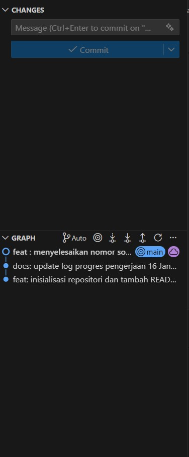
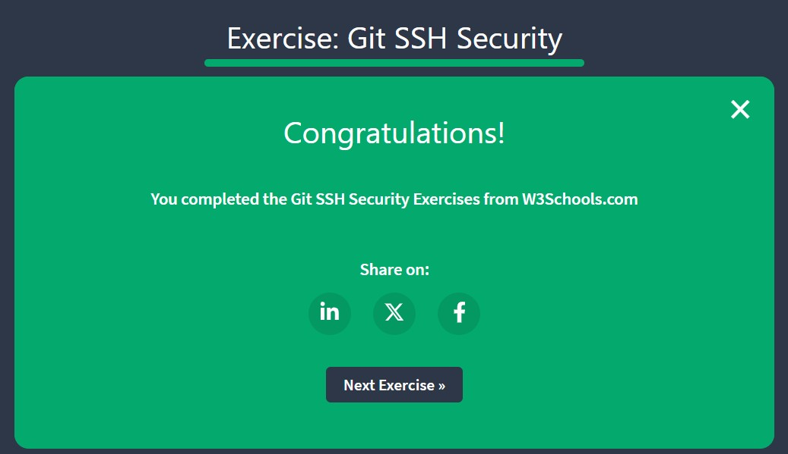
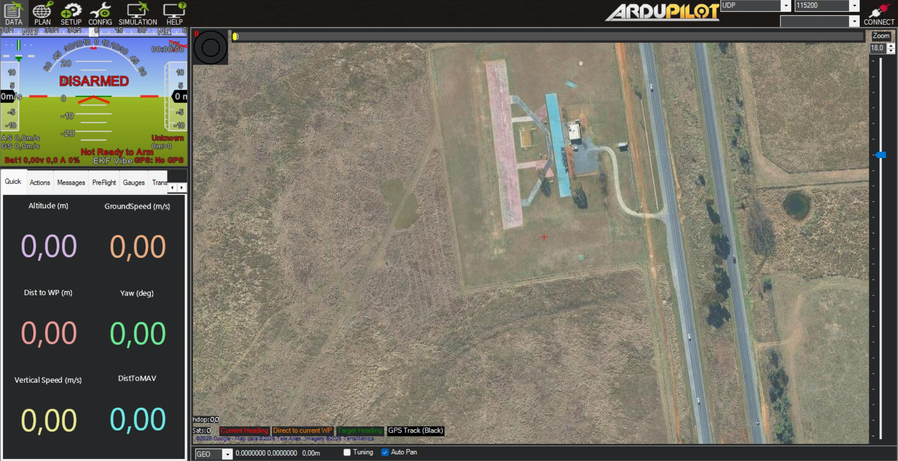
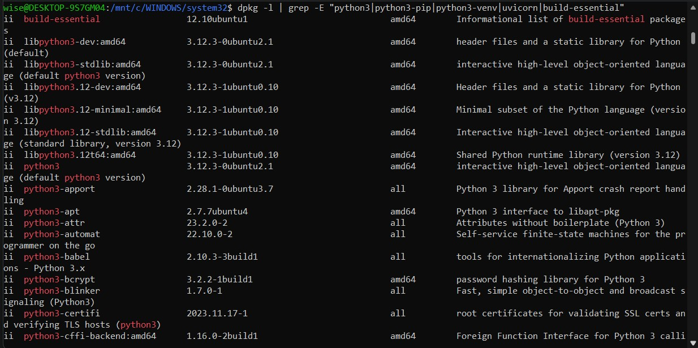

# Jawaban Soal A

## 1. Analisis Kondisi (10 Poin)
- marknicho07@gmail.com

## 2. Source Control Management (16 poin)

### a. 4 commands dalam Git dan jelaskan kegunaan serta contoh penggunaannya.
1. git init
    - kegunaan : untuk menginisiasi suatu folder menjadi git repository
    - contoh penggunaan : D:\projects\drone\CaRSC26_16025088_THT> git init : Artinya menginisiasi folder CaRSC26_16025088_THT ke git
2. git branch
    - kegunaan : mengelola cabang dari pengerjaan kode
    - contoh penggunaan : git branch [nama-branch]: Membuat cabang baru.
3. git add
    - kegunaan : memindahkan perubahan file ke area persiapan (belum disimpan secara permanen)
    - contoh penggunaan : git add . : Menambahkan semua perubahan dan file baru di direktori saat ini ke Staging Area. 
4. git commit
    - kegunaan : menyimpan perubahan secara permanen yang telah dipilih (dengan git add)
    - contoh penggunaan : git commit -m "Pesan penjelasan perubahan di sini" : melakukan commit dan memberikan pesan

### b. menghubungkan Git dan VSCode dengan GitHub
- 

### c. Tamatkan 4 topik Main pertama
- 

### d. Git SSH Security
- 

### e. Branch

## 3. Pengenalan Ground Control Station

### a. Install mission planner
- 

### b. Kegunaan utama mission planner
- Memantau telemetry secara real time
- Membuat planning untuk misi penerbangan yang dimungkinkan untuk dilakukannya penentuan titik koordinat, ketinggian, dan kecepatan yang akan dilaksanakan oleh wahana terbang
- Memungkinkan pengaturan prosedur otomatis jika terjadi fail 
- Kalibrasi dan konfigurasi, memastikan stabilitas terbang dan akurasi navigasi drone

### c. Misi sederhana
- [Klik di sini untuk melihat file Waypoint Pemetaan](../lampiran/a/waypoint_pemetaan_80x100.waypoints)

## 4. Development environment
instalasi ubuntu menggunakan wsl

### a. ubuntu tools
- 

