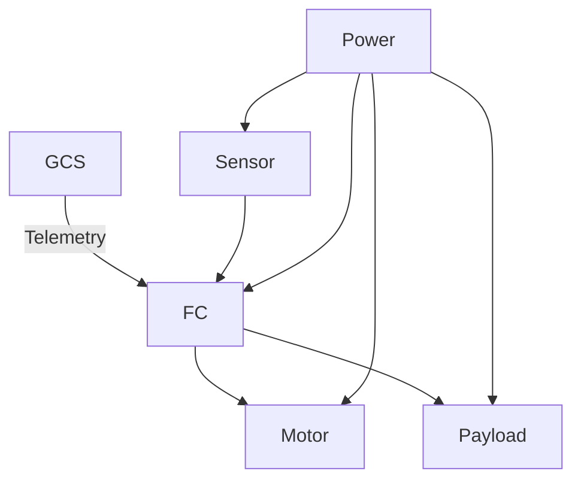

# Jawaban Soal A

## 1. Analisis Kondisi (10 Poin)
- marknicho07@gmail.com

## 2. Source Control Management (16 poin)

### a. 4 commands dalam Git dan jelaskan kegunaan serta contoh penggunaannya.
1. git init
    - kegunaan : untuk menginisiasi suatu folder menjadi git repository
    - contoh penggunaan : D:\projects\drone\CaRSC26_16025088_THT> git init : Artinya menginisiasi folder CaRSC26_16025088_THT ke git
2. git branch
    - kegunaan : mengelola cabang dari pengerjaan kode
    - contoh penggunaan : git branch [nama-branch]: Membuat cabang baru
3. git add
    - kegunaan : memindahkan perubahan file ke area persiapan (belum disimpan secara permanen)
    - contoh penggunaan : git add . : Menambahkan semua perubahan dan file baru di direktori saat ini ke Staging Area
4. git commit
    - kegunaan : menyimpan perubahan secara permanen yang telah dipilih (dengan git add)
    - contoh penggunaan : git commit -m "Pesan penjelasan perubahan di sini" : melakukan commit dan memberikan pesan

### b. menghubungkan Git dan VSCode dengan GitHub
- 

### c. Tamatkan 4 topik Main pertama
- 

### d. Git SSH Security
- 

### e. Branch
- 

## 3. Pengenalan Ground Control Station

### a. Install mission planner
- 

### b. Kegunaan utama mission planner
- Memantau telemetry secara real time
- Membuat planning untuk misi penerbangan yang dimungkinkan untuk dilakukannya penentuan titik koordinat, ketinggian, dan kecepatan yang akan dilaksanakan oleh wahana terbang
- Memungkinkan pengaturan prosedur otomatis jika terjadi fail 
- Kalibrasi dan konfigurasi, memastikan stabilitas terbang dan akurasi navigasi drone

### c. Misi sederhana
- [Klik di sini untuk melihat file Waypoint Pemetaan](../lampiran/a/waypoint_pemetaan_80x100.waypoints)

## 4. Development environment
instalasi ubuntu menggunakan wsl

### a. ubuntu tools
- 

### b. instalasi ROS 2 
- 

## 5. Dasar-dasar UAV

### a. Perbedaan VTOL, HTOL, dan Hybrid
- VTOL
    - Mekanisme Terbang
        - Gaya angkat dihasilkan langsung dari rotor yang berputar, sama seperti helikopter. Namun, dalam UAV, biasanya menggunakan 4 rotor (quadcopter) karena software lebih sederhana dengan lebih fokus ke kontrol kecepatan tiap rotornya, sementara konsep 1 rotor memerlukan kontrol mekanika juga yang cukup rumit
        - Rotor mempercepat aliran udara ke bawah (bentuk baling-baling menggunakan bentuk airfoil) sehingga UAV terdorong ke atas (hukum newton 3)
        - Tidak memerlukan kecepatan maju (seperti landasan) untuk menghasilkan lift
        - Hover dicapai dengan menyeimbangkan thrust dengan berat (F = mg)
    - Karakteristik
        - Take-off/landing : vertikal (tanpa runaway)
        - Kontrol
            - Roll & pitch : mengubah kecepatan rotor agar terjadi pitch (perbedaan thrust)
            - Yaw : mengatur kecepatan rotor juga untuk membuat perbedaan torsi rotor
    - Kelebihan
        - Hover presisi tinggi
        - kompleksitas mekanik rendah (khususnya multicopter)
        - Stabil dalam area sempit
    - Kekurangan
        - Boros baterai
        - Tidak efisien untuk perjalanan jauh (gaya angkat bergantung sepenuhnya pada rotor, tidak bisa memanfaatkan udara seperti menggunakan wing)
- HTOL 
    - Mekanisme terbang
        - Lift dihasilkan oleh sayap tetap (airfoil) akibat aliran udara saat UAV bergerak maju
        - Menggunakan prinsip Bernoulli + hukum newton : Tekanan bawah sayap > atas sayap. Sehingga udara mendorong UAV ke atas
        - Membutuhkan airspeed minimum untuk terbang (udara yang cukup untuk mendorong UAV ke atas)
    - Karakteristik
        - Take-off/Landing : horizontal (bisa menggunakan runaway, catapult, atau launcher untuk mencapai minimum speed)
        - kontrol
            - aileron (kemudi pada sayap) untuk membuat pesawat roll
            - Elevator (kemudi pada sayap belakang) untuk membuat pesawat pitch
            - Rudder (kemudi pada ekor) untuk kontrol Yaw
    - Kelebihan
        - Efisiensi tinggi (bantuan dari gaya angkat oleh udara)
        - Jangkauan panjang
        - Kecepatan jelajah tinggi
    - Kekurangan
        - Tidak bisa hover
        - Perlu area take-off/landing
        - Kurang presisi pada titik tertentu
- Hybrid 
    - mekanisme terbang 
        - Memiliki dual mode terbang
            - VTOL mode : menggunakan rotor vertikal untuk menghasilkan lift seperti multicopter sehingga bisa hover
            - Cruise mode : Memiliki sayap yang dengan menggunakan propeller yang memberikan thrust horizontal, bisa terbang seperti UAV HTOL
        - Dua macam transisi
            - Rotor yang berputar arah (lebih efisien karena rotor tetap terpakai untuk menambah kecepatan, tetapi lebih rumit)
            - Rotor mati saat mode cruise (rotor tidak berputar dan tetap menghadap vertikal)
    - karakteristik
        - Take-off / landing: Vertikal
        - Cruise: Horizontal seperti fixed-wing
    - Kelebihan
        - Tidak butuh runaway dan bisa hover, tetapi tetap bisa terbang jauh
        - Sangat fleksibel, bisa digunakan untuk small area maupun wide area
    - Kekurangan
        - Biaya lebih mahal
        - Sistem lebih kompleks
        - Lebih berat karena memiliki dual system

### b. gerak roll, yaw, dan pitch; air speed dan ground speed
1. Roll
    - Gerakan rotasi UAV terhadap sumbu longitudinal
    - Fungsi: belok kiri/kanan (banking)
2. yaw
    - Gerakan rotasi terhadap sumbu vertikal
    -   Fungsi: mengubah arah heading
3. pitch
    - Gerakan rotasi terhadap sumbu lateral
    - Fungsi: mengatur ketinggian dan sudut tanjak/turun
4. Air speed
    - Kecepatan UAV relatif terhadap udara di sekitarnya
    - Menentukan gaya angkat (lift) dan stabilitas terbang
5. Ground speed
    - Kecepatan UAV relatif terhadap permukaan tanah
    - Menentukan waktu tempuh dan jangkauan misi
Hubungan keduanya
-   Ground Speed = Airspeed ± Kecepatan Angin
1. HDOP (Horizontal Dilution of Precision) – GPS
    - Ukuran kualitas geometri satelit GPS terhadap akurasi posisi horizontal.
    - Nilai kecil = posisi lebih akurat.
    - HDOP besar -> satelit berkelompok → error posisi besar
2. RSSI (Received Signal Strength Indicator) – Telekomunikasi UAV
    - Ukuran kekuatan sinyal radio yang diterima UAV atau ground station.
    - Biasanya dalam dBm.
    - RSSI tinggi -> link komunikasi stabil
    - RSSI rendah -> risiko kehilangan kendali/telemetri

### c. Komponen-komponen dalam UAV
1. Airframe (Struktur UAV)
    - Berfungsi seperti sekeleton yang menjadi kerangka fisik UAV. Airframe berfungsi sebagai tempat menopang semua komponen (motor, sensor, payload, dll). Selain itu, airframe juga menentukan karakteristik aerodinamika
    - Relevansi mapping :
        - Airframe harus stabil dan minim vibrasi agar hasil citra tidak blur.
2. Propulsion System
    - Berfungsi sebagai alat penghasil thrust dan lift, juga sebagai alat yang mengontrol kecepatan dan manuver UAV
    - Komponen :
        - Motor
        - Propeler
        - ESC (Electronic Speed Controller)
    - Relevansi mapping :
        - Jika kecepatan konstan dan halus, pengambilan foto akan konsisten
3. Flight controller
    - Berfungsi sebagai otak dari UAV yang bisa membaca sensor, menghitung kontrol (stabilitas & navigasi), serta mengirim perintah ke motor
    - Komponen :
        - Microcontroller
        - Firmware (PX4 / ArduPilot)
    - Relevansi mapping :
        - Menjalankan waypoint
        - Menjaga ketinggian dan heading
        - Sinkronisasi kamera
4. Sensor System
    - Berfungsi seperti indranya UAV sehingga state dari UAV (posisi, kecepatan, orientasi) bisa ditentukan
    - Komponen : 
        - IMU (accelerometer + gyroscope) → orientasi
        - GPS → posisi
        - Barometer → ketinggian
        - Magnetometer → arah (heading)
    - Relevansi mapping :
        - Geotagging foto
        - Jalur terbang presisi
5. Payload
    - Berfungsi untuk mengumpulkan data (terutama pada pemetaan)
    - Contoh payload :
        - Kamera RGB
        - Multispectral camera
        - LIDAR (advanced)
    - Relevansi mapping :
        - Sebagai tujuan utama mapping, yakni mengumpulkan data
6. Communication system 
    - Berfungsi sebagai komunikasi antara wahana dengan manusia seperti mengirim data status UAV, mengirim perintah & misi, dan monitoring real-time
    - Komponen :
        - Telemetry radio
        - Ground Control Station (GCS)
7. Power System 
    - Berfungsi sebagai sumber energi utama dari UAV
    - Komponen : 
        - Battery
        - Power Distribution Board (PDB)
        - Voltage regulator
**Hubungan antar komponen**
- Sensor -> flight controller -> motor
- Payload bekerja sama dengan sistem kontrol
- Ground station berkomunikasi dengan flight controller

### d. Review paper
- [Klik untuk melihat review](../lampiran/a/Review%20paper%20UAV.pdf)

## 6. Algoritma
### a. A* (A-star) dan D* (D-star)
- A* adalah algoritma pencarian jalur terpendek di graf dengan menyeimbangkan:
        - biaya yang sudah ditempuh (g(n))
        - perkiraan biaya ke tujuan (h(n))
    $$
    \(f(n)=g(n)+h(n)\)
    $$
    - Langkah ringkas:
        - Mulai dari node awal
        - Hitung f(n) untuk semua kandidat jalur
        - Pilih node dengan f(n) paling kecil
        - Ulangi sampai tujuan tercapai
    Jika heuristik h(n) admissible, A* optimal

- D* adalah versi adaptif A* untuk lingkungan berubah
    - Tidak menghitung ulang dari nol
    - Saat ada rintangan baru, D* memperbarui jalur secara lokal
    - Digunakan kapan & di mana
        - Lingkungan dinamis & tidak sepenuhnya diketahui
        - UAV eksplorasi, rover Mars NASA, robot SAR (Search and Rescue)

### b. PID Controller
PID adalah algoritma kontrol feedback yang mengoreksi error antara: **Setpoint-Output**
PID adalah singkatan dari:
1. Proportional (P)
    - Reaksi langsung terhadap error
    - Error besar -> koreksi besar
2. Integral (I)
    - Mengakumulasi error masa lalu.
    - Menghilangkan steady-state error
3. Derivative (D)
    - Melihat laju perubahan error
    - Meredam overshoot dan osilasi
output : 

$$
\(u(t)=K_{p}e(t)+K_{i}\int e(t)dt+K_{d}\frac{de(t)}{dt}\)
$$

- Digunakan untuk attitude control (roll, pitch, yaw)

### c. Kalman Filter & Extended Kalman Filter (EKF)
Kalman Filter (KF) digunakan untuk sistem linear, di mana hubungan antara keadaan dan pengukuran dapat ditulis sebagai persamaan linear

Extended Kalman Filter (EKF) digunakan untuk sistem non-linear, seperti gerak dan rotasi UAV. EKF bekerja dengan melinierkan sistem non-linear secara lokal menggunakan Jacobian, lalu menerapkan prinsip Kalman Filter

- Keduanya bekerja dengan dua langkah utama :
    - Prediksi keadaan berdasarkan model sistem
    - Koreksi menggunakan data sensor yang berisik

Perbedaan utama:
EKF mampu menangani non-linearitas, sedangkan KF tidak

Penggunaan EKF:
Navigasi dan sensor fusion pada UAV

