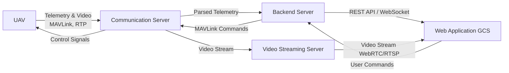

# Jawaban Soal B

## 1. Pemrograman berorientasi objek
### a. konsep-konsep dasar OOP
- Class 
    - definisi : Blueprint / cetak biru yang mendefinisikan atribut dan perilaku
```cpp
class UAV {
public:
    double speed;
    void fly() {
        // do something
    }
};
```
- Object 
    - definisi : Hasil jadi dari class
```cpp
UAV drone1;
drone1.fly();
```

- Abstraction
    - definisi : Hanya menampilkan luarannya dan menyembunyikan detail
```cpp
class UAV {
public:
    void fly(); // detail disembunyikan
};
```

- Encapsulation
    - definisi : melindungi data agar tidak bisa diubah sembarangan
```cpp
class UAV {
private:
    double battery;
public:
    double getBattery() {
        return battery;
    }
};
```

- Inheritance
    definisi : class baru yang mewariskan class lama
```cpp
class FixedWing : public UAV {
};
```
- Polymorphism
    - definisi : Method dengan nama sama, tapi perilaku berbeda tergantung objeknya
```cpp
class UAV:
    def fly(self):
        print("UAV terbang")

class FixedWing(UAV):
    def fly(self):
        print("Fixed-wing")

class Quadrotor(UAV):
    def fly(self):
        print("Quadrotor")
```

### b. Design pattern

## 2. C++
1. #include <file_name> vs include "file_name"
    - Include <> digunakan untuk menginput library standar atau eksternal
    - Include "" digunakan untuk menginput file buatan sendiri
2. #ifdef, #ifndef, #endif dan #pragma once
    - ifndef (if not defined): Memeriksa "Apakah file ini sudah pernah di define"
    - #ifdef (if defined) : Kebalikan dari #ifndef, digunakan jika ingin mengeksekusi kode hanya jika suatu file sudah didefinisikan
    - #endif: Menandai akhir dari blok pemeriksaan (pemeriksaan ifndef/ifdef)
    - pragma once : Fungsinya sama persis dengan Include Guards, namun lebih praktis. Tidak perlu menulis ifdef, ifndef, dan endif
3. namespace dan scope resolution operator (::)
    - Namespace = mencegah konflik nama
    - :: = mengakses sesuatu di dalam namespace
4. #define vs using
    - #define = preprocessor, tidak punya tipe
    - using = fitur C++, aman dan punya tipe
5. Pointer (*) dan Address-of (&)
    - & = mengambil alamat memori
    - " * " = menyimpan / mengakses data lewat alamat
6. Pass by Value vs Pass by Reference
    - Pass by value = dikopi
    - Pass by reference = data asli diubah
7. std::unique_ptr vs std::shared_ptr
- unique_ptr
    - satu pemilik, tidak bisa dibagi
    - paling cepat & aman
- shared_ptr
    - anyak pemilik, pakai reference counting
    - lebih fleksibel tapi lebih berat

## 3. Multithreading
### a. Penjelasan konsep
- Multithreading adalah teknik di mana satu program menjalankan beberapa kode (thread) sekaligus agar lebih cepat, responsif, dan efisien. Setiap thread berbagi memori dan resource yang sama, tetapi memiliki alur instruksi sendiri.

### b. Contoh kasus
- Klik kode [Di sini](../src/b/daspro/multithreading.py)
- 

## 4. file pipeline_parser.hpp dan vision_to_mavros.hpp.


## 5. Firmware dan Sistem Benam
1. firmware dan perbedaannya dengan perangkat lunak (software)
- Firmware adalah perangkat lunak tingkat rendah yang biasanya langsung pada hardware agar bisa langsung mengontrol hardware. Biasanya disimpan di memori non-volatile (flash/ROM).
- Perbedaannya dengan software pada umumnya adalah kalau software berhubungan dengan pengguna, firmware dengan elektroniknya. Sehingga, beberapa hal seperti UI, update yang sering, dan tidak real-time terdapat pada software. Selain itu, biasanya software terletak pada OS.
- Peran firmware dalam UAV
    - membaca sensor (IMU, GPS, barometer)
    - menjalankan kontrol (PID)
    - mengatur motor (ESC)
    - mengelola komunikasi (telemetri)
- Contoh firmware UAV: PX4, ArduPilot 
2. RTOS
- RTOS adalah sistem operasi yang menjamin respon tepat waktu (deterministik) terhadap suatu kejadian.
- Mengapa penting? UAV memiliki kontrol motor yang harus memiliki delay seminimal mungkin (tepat waktu) agar kontrol bisa berjalan dengan baik. Tanpa RTOS, UAV bisa tidak stabil bahkan crash karena keterlambatan menerima task
- Beberapa fitur RTOS :
    - task scheduling
    - real-time constraint
- Contoh RTOS di UAV: NuttX, FreeRTOS
3. UART, SPI, I2C
- Komunikasi serial = data dikirim bit demi bit antar perangkat
- UART (Universal Asynchronous Receiver Transmitter)
    - Fitur :
        - Asynchronous (tanpa clock)
        - Point-to-point
        - Sederhana
        - Kecepatan sedang
    - Penggunaan di UAV
        - GPS
        - Telemetri (radio)
        - Debugging
- SPI (Serial Peripheral Interface)
    - Fitur :
        - Synchronous (pakai clock)
        - Master–slave
        - Cepat
        - Banyak kabel
    - Penggunaan di UAV
        - IMU (gyro, accelerometer)
        - Flash memory
- I2C (Inter-Integrated Circuit)
    - Fitur :
        - Synchronous
        - Banyak device di satu bus
        - Lambat tapi hemat kabel
    - Penggunaan di UAV
        - Barometer
        - Magnetometer
        - Sensor suhu

# Jurusan Concept
## 1. konsep dasar ROS2 (Humble)
1. Nodes
- Node adalah program kecil yang menjalankan satu tugas spesifik dalam sistem robot/UAV
- Di ROS, satu node = satu fungsi utama
- Bagaikan sebuah pesawat, setiap bagian dikendalikan satu orang. Ada yang pemantau menggunakan kamera, ada yang mount senjata, ada yang menjadi pilot. Semuanya mengerjakan satu tugas spesifik
2. Topics
- jalur komunikasi satu arah untuk mengirim data tanpa henti
- Di ROS, node bisa publish (mengirim data) dan subscribe (menerima data)
- Bagaikan radio broadcast, pengirim tidak peduli siapa yang menerima, penerima tinggal mendengarkan
3. Services
- Service adalah komunikasi dua arah: request dan response
- Dipakai untuk aksi cepat & sekali jalan
- nanya sesuatu terus nunggu jawabannya 
4. Parameters
- nilai konfigurasi yang bisa dibaca/diubah oleh node saat runtime
- Seperti aturan tertulis tapi tidak disampaikan
    - Aturan tidak bicara
    - Aturan tidak mengirim pesan
    - Aturan bisa diganti
5. Actions
- Task berdurasi lama yang bisa dimonitor
- Analoginya seperti menyuruh sebuah robot mengerjakan sesuatu, dan setiap dia sampai ke checkpoint, laporkan. Proses ini tidak berhenti sampai disuruh

## 2. sistem publisher dan subscriber dalam C++

## 3. sistem service dan client dalam C++

## 4. Pinhole Camera Model
1. Penjelasan
- Pinhole camera model adalah model yang menjelaskan bagaimana setiap titik yang ada dalam dunia 3D diproyeksikan ke dunia 2D image plane melalui satu titik kecil (pinhole) tanpa lensa. Dianggap sebagai aproksimasi yang ideal  untuk algoritma visi komputer termasuk kalibrasi dan rekonstruksi scene


2. homogeneous coordinates dan rigid transformation
- homogeneous coordinates
    - representasi titik untuk mempermudah operasi proyeksi dan transformasi dalam projective geometry
        - Titik 3D Euclidean (X,Y, Z) direpresentasikan sebagai (X,Y,Z,1)
        - Titik 2D Euclidean (u, v) direpresentasikan sebagai (u, v, 1)
        - Homogeneous mempermudah proyeksi menjadi perkalian matriks linier
    - Persamaan umum $$y \sim K[R|t]x$$
    - $x = [X, Y, Z, 1]^T$ adalah titik dunia homogen
    - $y$ adalah titik image homogen
    - $K$ adalah matriks parameter intrinsik
    - $[R|t]$ adalah rotasi dan translasi (ekstrinsik)
- Rigid transformation
    - perpindahan dan rotasi yang mempertahankan jarak antar titik
    - Persamaan umum 
    $$X_{\text{cam}} = R X_{\text{world}} + t$$
    - $R$: Matriks rotasi berukuran $3 \times 3$
    - $t$: Vektor translasi berukuran $3 \times 1$

3. parameter intrinsik dan parameter ekstrinsik kamera
- Parameter Intrinsik
    - Parameter yang menggambarkan geometri internal kamera
        - Focal length ($f_x, f_y$)
        - Principal point ($c_x, c_y$)
        - Skew (biasanya 0)
    - Disusun dalam matriks kalibrasi \(K\): 
$$
K = \begin{bmatrix}
f_x & 0 & c_x \\
0 & f_y & c_y \\
0 & 0 & 1
\end{bmatrix}
$$
- Parameter Ekstrinsik
    - Parameter yang menggambarkan pose kamera di dunia
        - posisi dan orientasi kamera (melalui R, t)
- Perbedaannya, intrinsik lebih fokus ke pada lensa dan sensor, seperti tingkat zoom, titik tengah gambar, dll. Sementara ekstrinsik, lebih fokus ke di mana kamera berada dan bagaimana ia menghadap

4. Perbedaan Perspective Projection vs Weak-Perspective Projection
- Perspective Projection
    - Proyeksi titik 3D ke 2D bergantung pada kedalaman Z. Objek yang lebih jauh tampak lebih kecil dan garis paralel bisa bertemu ke titik hilang

$$x = f \frac{X}{Z}, \quad y = f \frac{Y}{Z}$$

- Weak-Perspective Projection
    - aproksimasi linear dari perspective projection yang berlaku jika objek relatif kecil dalam kedalaman dan jaraknya jauh dari kamera
    - Dasar idenya:
        - Semua titik dianggap pada kedalaman rata-rata ($\bar{Z}$)
        - Sehingga bisa disederhanakan menjadi: $$x' \approx sX, \quad y' \approx sY$$
        - dengan skala $$s = \frac{f}{\bar{Z}}$$
        - Bertujuan mengurangi kompleksitas dan sering dipakai ketika variasi kedalamannya kecil
- perbedaan utama
    - Perspective mempertimbangkan Z di setiap titik, sehingga menghasilkan efek perspektif yang nyata
    - Weak-perspective menggunakan kedalaman rata-rata sehingga lebih linear dan cepat, namun kurang akurat jika depth bervariasi

5. Perbedaan Kalibrasi Kamera Linear vs Nonlinear
- Kalibrasi Kamera Linear
    - Kalibrasi linear (seperti Direct Linear Transform) menyusun hubungan proyeksi kamera dari banyak pasangan titik 3D–2D menjadi sistem persamaan linier untuk mencari parameter. Kalibrasi linear cepat dan memberi perkiraan awal parameter
- Kalibrasi Kamera Nonlinear
    - Setelah parameter awal didapat, kalibrasi nonlinear meminimalkan error non-linier antara proyeksi yang diperkirakan dan titik aslinya (contohnya menggunakan Levenberg–Marquardt). Hal ini memberi akurasi yang lebih tinggi, tetapi harus iterasi dan lebih mahal secara komputasi

## 5. OpenCV
- [Source code](../src/b/concept/opencv/main.cpp)
- Gambar sebelum 
- Gambar sesudah 

## 6. tracking lingkaran

# Jurusan GCS
## 1. MAVLink
1. Struktur Pesan MAVLink
- MAVLink mengirim data dalam bentuk packet biner kecil dengan keunggulan efisien dan tahan error
- Dalam pesan, biasanya berisi :
    - Header - informasi dasar (versi, panjang payload)
    - Payload - data utama (misalnya posisi, kecepatan, status)
    - Checksum (CRC) - deteksi error

2. System ID dan Component ID
- Digunakan agar banyak perangkat bisa menggunakan satu jalur komunikasi tanpa tabrakan
- System ID (sysid) - Mengidentifikasi kendaraan atau sistem utama
    - Contoh:
        - UAV = sysid 1
        - GCS = sysid 255
- Component ID (compid) - Mengidentifikasi bagian di dalam sistem
    - Contoh:
        - Autopilot
        - Kamera
        - Gimbal

3. Cara Kerja Heartbeat dalam MAVLink
- Heartbeat adalah pesan periodik (biasanya 1 Hz) untuk memberi tahu bahwa sistem masih hidup
    - Isi heartbeat antara lain:
        - jenis sistem (UAV, GCS, dll)
        - mode (manual, auto, guided)
        - status (armed / disarmed)
    - Fungsinya:
        - Deteksi connection lost
        - Mengetahui mode UAV saat ini
        - Sinkronisasi awal saat GCS terhubung

4. Jenis Pesan MAVLink yang Umum
- Status & Monitoring
    - HEARTBEAT
    - SYS_STATUS
    - BATTERY_STATUS\
Untuk cek kondisi UAV

- Position & Navigation
    - GLOBAL_POSITION_INT
    - LOCAL_POSITION_NED
    - GPS_RAW_INT\
Untuk navigasi dan pemetaan

- Command & Control
    - COMMAND_LONG
    - COMMAND_INT\
Mengirim perintah

- Mission
    - MISSION_ITEM
    - MISSION_COUNT\
Mengatur waypoint dan misi otomatis

## 2. Arsitektur web 

